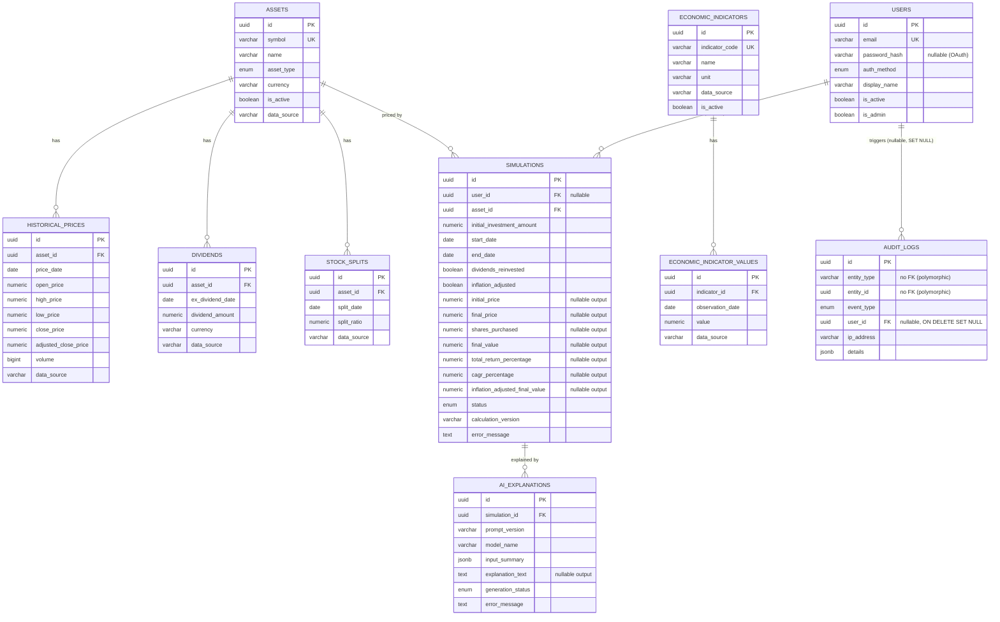

# Entity Relationship Design (Derived)

**Status: derived engineering documentation, not a founder-approved artifact.** Founder Specification Part 2.6.27 — Entity Relationship Design — was never written in the source document (confirmed gap; see [KNOWN_ISSUES.md](KNOWN_ISSUES.md) KI-004). This ERD was produced during the Database Schema milestone (M1) to fill that gap, generated from the actual SQLAlchemy models in `backend/app/models/`, and should be treated as a working reference pending founder review, not as a pre-approved design.

## Diagram

## Relationship notes

- **`assets` is the hub.** `historical_prices`, `dividends`, `stock_splits`, and `simulations` all FK to it. No delete cascade anywhere: assets are deactivated (`is_active = false`), never deleted, so a delete attempt while dependent rows exist is rejected by the database (default `NO ACTION`) rather than silently cascading away historical data.
- **`economic_indicators` / `economic_indicator_values`** is a self-contained catalog + time-series pair, structurally parallel to `assets` / `historical_prices` but intentionally not merged into it — see [ARCHITECTURE_DECISIONS.md](ARCHITECTURE_DECISIONS.md) ADR-008.
- **`simulations.user_id` is nullable** — anonymous simulations are allowed by design (Founder Specification Part 2.6.24).
- **`simulations` → `ai_explanations` is one-to-many**: a simulation can have multiple explanation attempts/versions; `ai_explanations.simulation_id` is NOT NULL — every explanation belongs to exactly one simulation.
- **`audit_logs` has two different kinds of "reference"**: `entity_type`/`entity_id` is a polymorphic pair with **no FK** (a documented, intentional exception — see [DATABASE_RULES.md](../.claude/DATABASE_RULES.md)), while `user_id` is a real FK to `users.id` with `ON DELETE SET NULL`, so the audit trail survives even if the referenced user account is later deleted.
- **No relationship in this schema is FK-cascade-delete.** The only non-default delete behavior anywhere is `audit_logs.user_id`'s `ON DELETE SET NULL`, chosen deliberately so audit history is never destroyed by a user deletion.

## Enums (native Postgres types)

| Enum | Values | Used by |
|---|---|---|
| `asset_type_enum` | stock, etf, crypto, market_index | `assets.asset_type` |
| `simulation_status_enum` | pending, completed, failed | `simulations.status` |
| `ai_generation_status_enum` | pending, completed, failed | `ai_explanations.generation_status` |
| `auth_method_enum` | email_password, google_oauth, github_oauth | `users.auth_method` |
| `audit_event_type_enum` | user_registered, user_login_succeeded, user_login_failed, user_logout, admin_action, data_import_succeeded, data_import_failed, simulation_created, ai_explanation_generated, ai_explanation_failed | `audit_logs.event_type` |

All five are native Postgres `ENUM` types storing the lowercase string value (not the Python enum member name) — see the `pg_enum()` helper in `backend/app/models/base.py`.

## Regenerating this diagram

This file is derived, not hand-maintained truth — if the models change, regenerate the "Diagram" and "Enums" sections from `backend/app/models/` rather than hand-editing them out of sync. The "Relationship notes" section is where actual reasoning lives and should be updated deliberately alongside any schema change.
